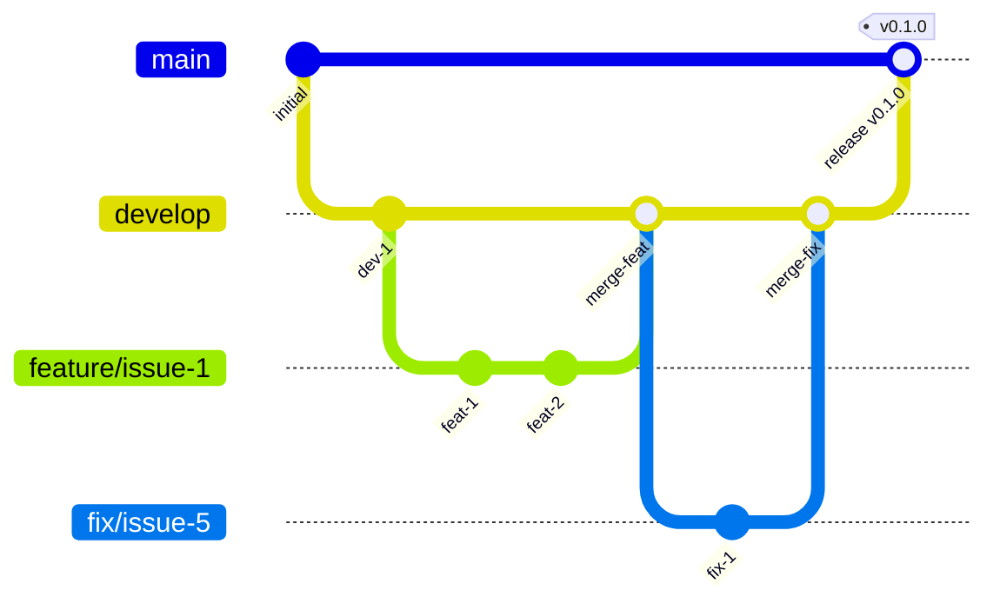

# Contributing to wagtail-asset-publisher

Thank you for your interest in contributing!

## Development Setup

### Prerequisites

- Python 3.10+ (for basic development)
- **Python 3.10, 3.11, 3.12, 3.13, 3.14** (for full matrix testing with tox)
- **uv 0.9.0+** (recommended) or pip
  - For Python 3.14 support, uv 0.9.0 or later is required
  - Check version: `uv --version`
  - Update: `curl -LsSf https://astral.sh/uv/install.sh | sh`

#### Installing Multiple Python Versions

For full matrix testing, you'll need all supported Python versions installed.

**Using uv (recommended):**
```bash
# Install all supported Python versions
uv python install 3.10 3.11 3.12 3.13 3.14

# Verify installations
uv python list
```

> **Note:** Python 3.14 may be in alpha/beta during development. If you encounter stability issues with Python 3.14 tests (e.g., segmentation faults), this is expected for pre-release versions. The CI workflow tests against the stable release.

**Alternative: Using pyenv:**
```bash
# Install pyenv
curl https://pyenv.run | bash

# Install all supported Python versions
pyenv install 3.10.16
pyenv install 3.11.11
pyenv install 3.12.8
pyenv install 3.13.1
pyenv install 3.14.0

# Make them available globally
pyenv global 3.13.1 3.10.16 3.11.11 3.12.8 3.14.0
```

### Clone and Setup

```bash
git clone https://github.com/kkm-horikawa/wagtail-asset-publisher.git
cd wagtail-asset-publisher

# Using uv (recommended)
uv venv
source .venv/bin/activate
uv pip install -e ".[dev]"

# Or using pip
python -m venv .venv
source .venv/bin/activate
pip install -e ".[dev]"
```

To work on optional features, install the corresponding extras:

```bash
# CSS minification and JS optimization (rcssmin + rjsmin)
uv pip install -e ".[dev,minify]"

# Tailwind CSS JIT support
uv pip install -e ".[dev,tailwind]"

# All extras
uv pip install -e ".[dev,minify,tailwind]"
```

> **Note:** We use `uv pip install` instead of `uv sync` because this is a **library project**.
> We don't commit `uv.lock` to maintain dependency flexibility for downstream users.
> See [Project Management](#project-management) for more details.

### Running Tests

```bash
pytest
```

### Running Matrix Tests Locally

To test against all supported Python/Django/Wagtail combinations (34 total):

```bash
# Install tox
uv pip install tox

# Run all 34 combinations
tox

# Test specific Python version (all Django/Wagtail combinations)
tox -e py314

# Test specific combination
tox -e py314-django52-wagtail72

# Run in parallel (faster)
tox -p auto

# Pass pytest arguments
tox -- -k test_specific

# List all available environments
tox -l
```

This matches the CI matrix exactly, allowing you to verify compatibility before pushing.

**Note:** Tox will create virtual environments for each combination. The first run will be slow, but subsequent runs are faster due to caching.

## Supported Versions

### Python Versions
- **3.10** (minimum)
- **3.11**
- **3.12**
- **3.13**
- **3.14** (latest)

### Django Versions
- **4.2** (LTS - Long Term Support until April 2026)
- **5.1**
- **5.2** (LTS - Long Term Support until April 2028)

### Wagtail Versions
- **6.4**
- **7.0** (LTS - Long Term Support)
- **7.2** (latest)

## Version Compatibility Matrix

Our CI tests 34 valid combinations of Python, Django, and Wagtail versions.

### Compatibility Table

| Python | Django 4.2 | Django 5.1 | Django 5.2 |
|--------|------------|------------|------------|
| **Wagtail 6.4** ||||
| 3.10 | ✅ | ✅ | ❌ |
| 3.11 | ✅ | ✅ | ✅ |
| 3.12 | ✅ | ✅ | ✅ |
| 3.13 | ✅ | ✅ | ✅ |
| 3.14 | ❌ | ❌ | ❌ |
| **Wagtail 7.0** ||||
| 3.10 | ✅ | ✅ | ❌ |
| 3.11 | ✅ | ✅ | ✅ |
| 3.12 | ✅ | ✅ | ✅ |
| 3.13 | ✅ | ✅ | ✅ |
| 3.14 | ❌ | ❌ | ❌ |
| **Wagtail 7.2** ||||
| 3.10 | ✅ | ✅ | ❌ |
| 3.11 | ✅ | ✅ | ✅ |
| 3.12 | ✅ | ✅ | ✅ |
| 3.13 | ✅ | ✅ | ✅ |
| 3.14 | ❌ | ❌ | ✅ |

**Summary:**
- **Total combinations**: 45 (5 Python × 3 Django × 3 Wagtail)
- **Valid combinations**: 34 (tested in CI)
- **Excluded combinations**: 11

### Exclusion Rationale

Certain combinations are excluded due to compatibility constraints:

1. **Python 3.10 + Django 5.2**: Django 5.2 requires Python 3.11+
2. **Python 3.14 + Django 4.2/5.1**: Python 3.14 is only supported by Django 5.2+
3. **Python 3.14 + Wagtail 6.4/7.0**: Python 3.14 is only supported by Wagtail 7.2+

These exclusions are based on official compatibility tables:
- [Django FAQ: Installation](https://docs.djangoproject.com/en/stable/faq/install/)
- [Wagtail Upgrading Guide](https://docs.wagtail.org/en/stable/releases/upgrading.html)

## Test Matrix Strategy

### CI Workflow
Our GitHub Actions CI tests all 34 valid combinations in parallel, ensuring compatibility across:
- All supported Python versions
- All supported Django versions
- All supported Wagtail versions

See `.github/workflows/ci.yml` for the complete matrix configuration.

### Local Testing with tox
Use `tox` to replicate the CI matrix locally before pushing:

```bash
# Test all 34 combinations
tox

# Test specific Python version
tox -e py314

# Test specific combination
tox -e py314-django52-wagtail72
```

### Why No `uv.lock`?

This is a **library project**, not an application. We intentionally don't commit `uv.lock` to:

- Allow downstream users to resolve dependencies based on their own constraints
- Maintain maximum compatibility across different environments
- Avoid forcing specific transitive dependency versions

Applications should use lock files for reproducible builds. Libraries should not.

### Code Style

```bash
# Format code
ruff format .

# Lint
ruff check .

# Type check
mypy src/
```

## Coding Standards

### Overview

| Item | Standard |
|------|----------|
| Formatter/Linter | [Ruff](https://docs.astral.sh/ruff/) |
| Line length | 88 characters |
| Quotes | Double quotes `"` |
| Type hints | Required for public APIs |
| Docstrings | Google style |

### Naming Conventions

| Type | Convention | Example |
|------|------------|---------|
| Class | PascalCase | `AssetPublisherMixin`, `RawAssetBuilder` |
| Function/Method | snake_case | `get_builder`, `build_assets` |
| Variable | snake_case | `builder_type`, `asset_content` |
| Constant | UPPER_SNAKE_CASE | `DEFAULT_HASH_LENGTH`, `DEFAULT_TIMEOUT` |
| Private method | _leading_underscore | `_validate_path` |

### Type Annotations

Required for:
- All function parameters and return types
- Public methods
- Complex variables

```python
def get_builder(
    builder_path: str,
    asset_type: str = "css",
) -> BaseAssetBuilder:
    """Import and instantiate an asset builder.

    Args:
        builder_path: Dotted import path to the builder class.
        asset_type: Type of asset ("css" or "js").

    Returns:
        An instance of the specified asset builder.
    """
    builder_class = import_class(builder_path)
    return builder_class()
```

### Django Model Convention

```python
class AssetPublisherMixin(models.Model):
    """Mixin for Wagtail pages to manage CSS/JS assets.

    Attributes:
        css_source: Raw CSS source code.
        js_source: Raw JavaScript source code.
        css_url: URL to the published CSS file.
        js_url: URL to the published JS file.
    """

    # Fields
    css_source = models.TextField(blank=True, default="")
    js_source = models.TextField(blank=True, default="")
    css_url = models.URLField(blank=True, default="", editable=False)
    js_url = models.URLField(blank=True, default="", editable=False)

    class Meta:
        abstract = True

    def build_and_publish_assets(self) -> None:
        """Build and publish CSS/JS assets for this page."""
        ...
```

### Import Order

```python
# 1. Standard library
from datetime import datetime
from typing import Any

# 2. Third-party packages
from django.db import models
from wagtail.fields import StreamField

# 3. Local imports
from wagtail_asset_publisher.builders.raw import RawAssetBuilder
```

Ruff's isort will automatically organize imports.

### Testing Standards

#### Test Structure

```
tests/
├── conftest.py              # Shared fixtures
├── test_models.py           # Mixin model tests
├── test_builders.py         # Builder tests
├── test_storage.py          # Storage backend tests
├── test_hooks.py            # Wagtail hook tests
├── test_signals.py          # Signal tests
├── test_utils.py            # Utility function tests
├── test_conf.py             # Configuration tests
└── test_templatetags.py     # Template tag tests
```

#### Test Naming

```python
class TestAssetPublisherMixin:
    """Tests for AssetPublisherMixin model."""

    def test_css_source_defaults_to_empty(self):
        """CSS source field defaults to empty string."""
        ...

    def test_build_publishes_css_to_storage(self):
        """Building assets publishes CSS to configured storage."""
        ...

    def test_empty_source_clears_url(self):
        """Empty source clears the corresponding URL field."""
        ...
```

Naming pattern: `test_<what>_<condition/expectation>`

#### Test Documentation

```python
def test_tailwind_cli_fallback_to_raw(self):
    """TailwindCSSBuilder falls back to raw CSS when CLI fails.

    【Test Intent】
    Ensure graceful degradation when Tailwind CLI is unavailable.

    【What This Guarantees】
    - Page still gets CSS even if Tailwind CLI is missing
    - Raw CSS source is used as fallback
    - Error is logged but doesn't crash

    【Test Steps】
    1. Configure TailwindCSSBuilder
    2. Mock Tailwind CLI to raise FileNotFoundError
    3. Build CSS for a page with css_source
    4. Verify raw CSS is returned

    【Expected Result】
    Raw CSS source returned, error logged
    """
    ...
```

#### What to Test

**Good tests:**
- Boundary values (0, max, max+1)
- Business logic
- Error handling
- Edge cases

**Skip these:**
- Simple getters/setters
- `__str__` methods (unless complex)
- Framework behavior (Django/Wagtail already tests this)

#### Fixtures (conftest.py)

```python
import pytest
from unittest import mock


@pytest.fixture
def mock_page():
    """Create a mock page with AssetPublisherMixin fields."""
    page = mock.Mock()
    page.pk = 1
    page.css_source = "body { color: red; }"
    page.js_source = ""
    page.css_url = ""
    page.js_url = ""
    return page


@pytest.fixture
def mock_storage():
    """Create a mock storage backend."""
    storage = mock.Mock()
    storage.save.return_value = "/static/assets/page-1-abc123.css"
    return storage
```

#### Running Tests

```bash
# Run all tests
pytest

# Run with coverage
pytest --cov=wagtail_asset_publisher --cov-report=html

# Run specific test file
pytest tests/test_models.py

# Run specific test
pytest tests/test_models.py::TestAssetPublisherMixin::test_css_source_defaults_to_empty
```

#### Coverage Target

- Overall: 90%+
- Models: 95%+
- Blocks: 90%+

## Project Structure

```
wagtail-asset-publisher/
├── src/
│   └── wagtail_asset_publisher/
│       ├── __init__.py
│       ├── apps.py             # Django app configuration
│       ├── conf.py             # Settings management
│       ├── hooks.py            # Wagtail publish hooks
│       ├── models.py           # AssetPublisherMixin
│       ├── signals.py          # Cross-package signals
│       ├── utils.py            # Build orchestration
│       ├── builders/
│       │   ├── base.py         # BaseAssetBuilder ABC
│       │   ├── raw.py          # RawAssetBuilder
│       │   └── tailwind.py     # TailwindCSSBuilder
│       ├── storage/
│       │   ├── base.py         # BaseAssetStorage ABC
│       │   ├── django_storage.py  # Django default_storage
│       │   └── local.py        # Local filesystem
│       └── templatetags/
│           └── asset_publisher_tags.py
├── tests/
├── pyproject.toml
├── README.md
└── CONTRIBUTING.md
```

## Branch Strategy

We use a modified Git Flow strategy:



### Branch Types

| Branch | Purpose | Base | Merge To |
|--------|---------|------|----------|
| `main` | Production releases | - | - |
| `develop` | Development integration | `main` | `main` |
| `feature/*` | New features | `develop` | `develop` |
| `fix/*` | Bug fixes | `develop` | `develop` |
| `hotfix/*` | Urgent production fixes | `main` | `main` + `develop` |
| `chore/*` | Maintenance, config, dependencies | `develop` | `develop` |
| `docs/*` | Documentation updates | `develop` | `develop` |

### Branch Naming

```
feature/<issue-number>-<short-description>
fix/<issue-number>-<short-description>
hotfix/<issue-number>-<short-description>
chore/<short-description>
docs/<short-description>
```

Examples:
- `feature/1-reusable-block-model`
- `fix/12-circular-reference-detection`
- `hotfix/15-security-patch`
- `chore/update-dependencies`
- `docs/api-reference`

### Protected Branches

| Branch | Direct Push | PR Required | Delete Protection |
|--------|-------------|-------------|-------------------|
| `main` | No | Yes | Yes |
| `develop` | No | Yes | Yes |

## Development Workflow

### For External Contributors (Fork-based)

1. **Fork the repository** on GitHub
2. **Clone your fork**:
   ```bash
   git clone https://github.com/<your-username>/wagtail-asset-publisher.git
   cd wagtail-asset-publisher
   ```
3. **Add upstream remote**:
   ```bash
   git remote add upstream https://github.com/kkm-horikawa/wagtail-asset-publisher.git
   ```
4. **Create a branch from develop**:
   ```bash
   git fetch upstream
   git checkout -b feature/<issue-number>-<description> upstream/develop
   ```
5. **Make changes, commit, and push to your fork**:
   ```bash
   git push origin feature/<issue-number>-<description>
   ```
6. **Create a Pull Request** from your fork to `upstream/develop`

### Testing Your Changes in a Wagtail Project

Before submitting a PR, it's recommended to test your changes in a real Wagtail project:

1. **Install from your fork branch**:
   ```bash
   # In your Wagtail project directory
   pip install git+https://github.com/<your-username>/wagtail-asset-publisher.git@<your-branch>
   ```

2. **Add to INSTALLED_APPS** (if not already):
   ```python
   INSTALLED_APPS = [
       # ...
       "wagtail_asset_publisher",
       # ...
   ]
   ```

3. **Run migrations** (if your changes include model updates):
   ```bash
   python manage.py migrate
   ```

4. **Start the server** and verify your changes work correctly

### For Maintainers (Direct)

We recommend using **Draft PRs** for planning and early feedback.

#### 1. Check Existing Issues

Before starting work, check the [Issue Tracker](https://github.com/kkm-horikawa/wagtail-asset-publisher/issues).

- Search for existing issues to avoid duplication
- Comment on the issue to claim it
- If no issue exists, create one first

#### 2. Create a Branch

```bash
# Start from develop
git checkout develop
git pull origin develop

# Create feature or fix branch
git checkout -b feature/<issue-number>-<description>
# or
git checkout -b fix/<issue-number>-<description>
```

#### 3. Create a Draft PR (Recommended)

Creating a Draft PR **before implementing** provides several benefits:

- **Early feedback**: Get architectural guidance before investing time
- **Avoid rework**: Catch potential issues early
- **Communication**: Team knows what you're working on
- **Planning**: Forces you to think through the approach
- **Progress tracking**: Can commit work-in-progress safely

```bash
# Create an empty commit to initialize the PR
git commit --allow-empty -m "feat: initialize <feature name>

Track progress for #<issue-number>"

# Push and create Draft PR
git push -u origin feature/<issue-number>-<description>
```

Then create a **Draft Pull Request** on GitHub with:

- Reference: `Closes #<issue-number>`
- Implementation plan as checkboxes:
  ```markdown
  ## Implementation Plan
  - [ ] Create model
  - [ ] Add admin interface
  - [ ] Write tests
  - [ ] Update documentation
  ```
- Test strategy outline

#### 4. Implement

- Follow the plan in your Draft PR
- Write tests for new functionality
- Follow existing code style
- Commit regularly with clear messages
- Update PR checkboxes as you progress

#### 5. Test Your Changes

```bash
pytest
ruff check .
ruff format --check .
mypy src/
```

#### 6. Commit

Follow [Conventional Commits](https://www.conventionalcommits.org/):

```bash
git commit -m "feat: add ReusableBlockChooserBlock"
git commit -m "fix: resolve circular reference detection"
git commit -m "docs: update installation guide"
```

#### 7. Mark PR as Ready for Review

When implementation is complete:

- Ensure all tests pass locally
- Update documentation if needed
- Mark PR as "Ready for review"

#### 8. Self-Review and Merge

For **maintainers and core contributors**:

- You may approve and merge your own PRs if:
  - All CI checks pass
  - The change is well-documented
  - Tests are included
  - The PR has been open for reasonable time (for feedback)

Use admin privileges to bypass approval requirements when appropriate.

### Release Process (Maintainers only)

When ready to release:
1. Create PR from `develop` to `main`
2. After merge, tag the release: `git tag v0.x.0`
3. Push tag: `git push origin v0.x.0`

## Project Management

### Our Philosophy

This is an **open-source project built by volunteers**. Our management approach reflects this:

- ✅ **No time estimates or strict deadlines** - Contributors work at their own pace
- ✅ **Quality over speed** - We'd rather ship it right than ship it fast
- ✅ **Clear issue descriptions** - Every issue has acceptance criteria
- ✅ **Transparent dependencies** - We use parent/child and blocked-by relationships
- ✅ **Version-based milestones** - Group features by version, not by date

### Labels

We use labels to categorize and prioritize work:

| Label | Meaning | When to Use |
|-------|---------|-------------|
| `good first issue` | Great for newcomers | Small, well-defined tasks |
| `priority:critical` | Requires immediate attention | Security, data loss, blocks other work |
| `priority:high` | Important, affects multiple people | Features needed by many, impactful bugs |
| `priority:medium` | Normal priority | Default for most issues |
| `priority:low` | Nice to have | Future improvements, minor enhancements |
| `atomic` | Small, focused issue | No sub-issues needed, single PR |
| `parent` | Has sub-issues | Large task broken into smaller pieces |
| `child` | Sub-issue of a parent | Part of a larger task |
| `enhancement` | New feature or improvement | Adding functionality |
| `bug` | Something isn't working | Fixing broken behavior |
| `documentation` | Documentation improvements | README, guides, comments |

### Issue Relationships

We use GitHub's issue relationship features to show dependencies and task decomposition.

#### Parent/Child Relationships (Sub-issues)

Use when breaking large work into smaller, manageable tasks:

```bash
# Example: Set Issue #24 as a sub-issue of Issue #10
PARENT_ID=$(gh issue view 10 --json id --jq ".id")
CHILD_ID=$(gh issue view 24 --json id --jq ".id")
gh api graphql -H "GraphQL-Features: sub_issues" -f query='
mutation($parentId: ID!, $childId: ID!) {
  addSubIssue(input: { issueId: $parentId, subIssueId: $childId }) {
    issue { title number }
    subIssue { title number }
  }
}' -f parentId="$PARENT_ID" -f childId="$CHILD_ID"
```

**When to create sub-issues:**
- Task is too large for one PR
- Work can be parallelized among contributors
- Clear logical decomposition exists

**When NOT to create sub-issues:**
- Small, atomic tasks (use `atomic` label)
- Tasks that are naturally sequential

#### Blocked By Relationships

Use when an issue depends on another issue to be completed first:

```bash
# Example: Mark Issue #21 as blocked by Issue #10
ISSUE_ID=$(gh issue view 21 --json id --jq ".id")
BLOCKING_ID=$(gh issue view 10 --json id --jq ".id")
gh api graphql -H "GraphQL-Features: issue_types" -f query='
mutation($issueId: ID!, $blockingIssueId: ID!) {
  addBlockedBy(input: { issueId: $issueId, blockingIssueId: $blockingIssueId }) {
    issue { title number }
    blockingIssue { title number }
  }
}' -f issueId="$ISSUE_ID" -f blockingIssueId="$BLOCKING_ID"
```

### GitHub Issues

We use [GitHub Issues](https://github.com/kkm-horikawa/wagtail-asset-publisher/issues) to track progress.

### Why No Time Tracking?

Unlike commercial software projects, we don't track:
- Story points
- Time estimates
- Sprint deadlines
- Velocity

**Reasons:**
- OSS contributors are volunteers with varying availability
- Forcing deadlines creates unnecessary pressure
- Quality and correctness matter more than speed
- Contributors work at their own pace

Instead, we focus on:
- **What** needs to be done (clear acceptance criteria)
- **Why** it's important (context and motivation)
- **How** it relates to other work (dependencies)

## Key Documents

- [README.md](README.md) - Project overview and quick start

## Questions?

Open an [Issue](https://github.com/kkm-horikawa/wagtail-asset-publisher/issues) for questions or discussions.
